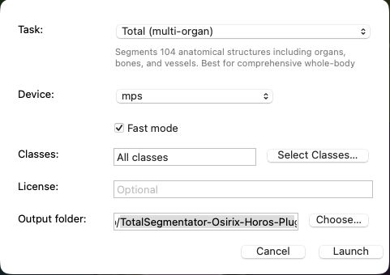
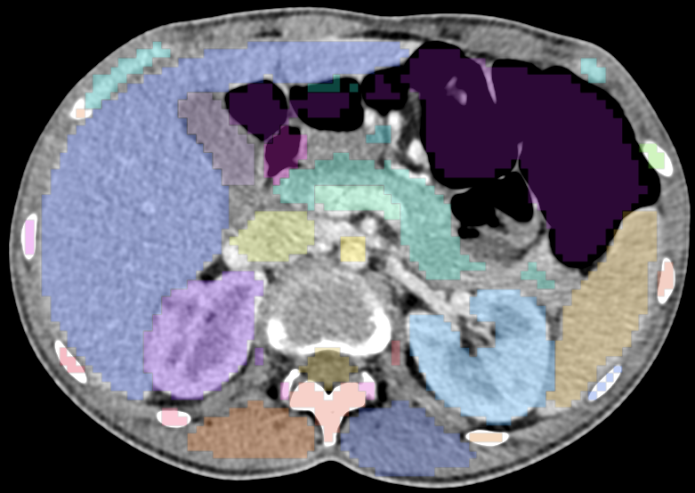
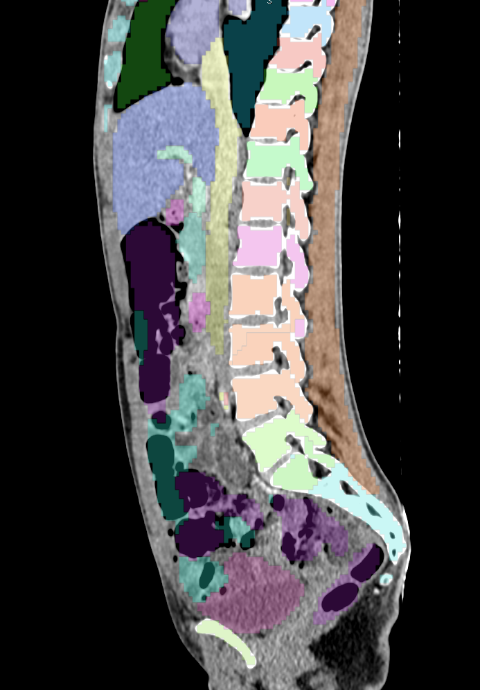
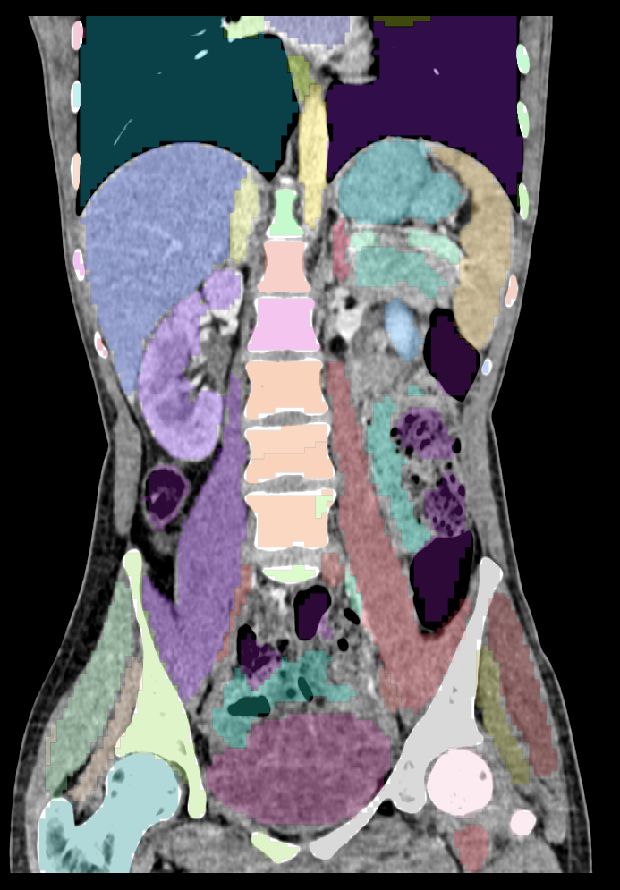

# TotalSegmentator OsiriX/Horos Plugin


---

## Overview

This private development repository packages the [TotalSegmentator](https://github.com/wasserth/TotalSegmentator) pipeline as a macOS Horos/OsiriX plugin for DICOM studies. It exports the active CT or MR series, runs the Python TotalSegmentator and nnUNet segmentation flow, then re-imports the generated results as volumetric brush/tPlain ROIs in the current viewer. RT-Struct export is disabled by default and can be enabled as an optional or required derived artifact for interoperability; displayed ROIs are built directly from the canonical voxel masks.

The repository still ships the upstream `totalsegmentator/` sources because the plugin reuses internal scripts and helpers, but the main purpose here is the native Swift plugin, the host-app bridge, and the packaging flow for Horos and OsiriX.

---

## Current Status

- ✅ End-to-end export → segmentation → import flow works for 2D CT/MR series.
- ✅ Isolated Python environment bootstrapped under `~/Library/Application Support/TotalSegmentatorHorosPlugin/PythonEnvironment`.
- ✅ Pinned `dcm2niix` bootstrap is available when the configured Python environment does not already provide it.
- ✅ The run UI includes grouped task selection, device selection (`Auto`, `cpu`, `gpu`, `mps`), fast mode, license entry, class selection, and output-directory selection.
- ✅ Volumetric brush/tPlain ROIs are generated from NIfTI voxel masks and applied to the active viewer (Horos ≥ 4.0.1 required).
- ✅ RT-Struct files can be generated/imported as optional database artifacts for interoperability.
- ✅ Python tests and Swift XCTest sources are present; host-app end-to-end validation is still manual.
- ⚠️ Horos must be running in English to avoid localization issues in menus.
- 🚧 Formal distribution as an installer `.pkg` is not yet available.

---

## Downloadable Builds

Need a prebuilt bundle? The latest checked-in debug packages currently present in `Releases/` are:

- [Horos debug package (2026-06-12)](Releases/TotalSegmentatorPlugin%20Horos%202026%2006%2012.osirixplugin.zip)
- [OsiriX debug package (2026-06-12)](Releases/TotalSegmentatorPlugin%20OsiriX%202026%2006%2012.osirixplugin.zip)

Older 2026-01-08 debug packages are also retained in `Releases/` for comparison.

Unzip the package first, then copy the extracted `.osirixplugin` bundle into the matching plugin folder:

- Horos: `~/Library/Application Support/Horos/Plugins/`
- OsiriX: `~/Library/Application Support/OsiriX/Plugins/`

After copying, run `codesign --force --deep --sign - "/path/to/plugin.osirixplugin"` if you need an ad-hoc local signature, then relaunch the host app. On first launch the plugin provisions its Python environment from `TotalSegmentatorEnvironmentLock.json` and writes the resolved `environment-manifest.json` under `~/Library/Application Support/TotalSegmentatorHorosPlugin/`. No additional files are required beyond Horos or OsiriX, a compatible macOS version, and an internet connection to fetch the locked Python packages and TotalSegmentator weights when needed.

---

## Screenshots

<table>
  <tr>
    <td align="center" width="50%"><br><sub>Configuration</sub></td>
    <td align="center" width="50%"><br><sub>Axial</sub></td>
  </tr>
  <tr>
    <td align="center" width="50%"><br><sub>Sagittal</sub></td>
    <td align="center" width="50%"><br><sub>Coronal</sub></td>
  </tr>
</table>

---

## Requirements

- macOS 14 or newer (validated on macOS 15.0.1).
- Horos 4.0.1 (build 20231016) or compatible OsiriX-based host.
- Xcode 15/16+ with Swift 5 toolchain.
- Python 3.11 through 3.12 on `arm64` or `x86_64` (the plugin provisions its own virtualenv when needed).
- Internet access on first setup so the plugin can install the packages locked in `TotalSegmentatorEnvironmentLock.json`, fetch model weights, and download the pinned `dcm2niix` binary if needed.
- Optional `rt_utils` only when RT-Struct export is enabled; canonical segmentation and volumetric ROI import do not require it.
- Optional GPU; CPU mode works, `--fast`/`--fastest` are exposed only for tasks that support them, and Apple Silicon `mps` is offered for inference only after the pinned PyTorch runtime passes the MPS smoke probe.
- Optional **GPU-accelerated resampling** (pre-processing) on Linux/Windows only when **CUDA** is available and the Python environment includes `cucim` + `cupy`.
  - When available, TotalSegmentator will automatically use cuCIM (CUDA) for spacing changes.
  - macOS/Apple Silicon is not supported for this path because CuPy/cuCIM wheels are not available; Apple Silicon **MPS** can run inference on GPU, but resampling falls back to CPU.

---

## Quick Build & Install

1. **Clone the repository**
   ```bash
   git clone https://github.com/ThalesMMS/TotalSegmentator-OsiriX-Horos-Plugin.git
   cd TotalSegmentator-OsiriX-Horos-Plugin
   ```

2. **Confirm the Xcode project is visible**
   ```bash
   xcodebuild -list -project MyOsiriXPluginFolder-Swift/TotalSegmentatorHorosPlugin.xcodeproj
   ```

3. **Build with the helper script**
   ```bash
   ./build.sh horos --sign
   # or: ./build.sh both --sign
   ```

4. **Install into Horos**
   ```bash
   PLUGIN_DST="$HOME/Library/Application Support/Horos/Plugins/"
   mkdir -p "$PLUGIN_DST"

   rm -rf "$PLUGIN_DST"/TotalSegmentatorPlugin*.osirixplugin
   cp -R Releases/Horos/*.osirixplugin "$PLUGIN_DST"
   ```

   For OsiriX builds, use `./build.sh osirix --sign` and copy from `Releases/Osirix/` into `~/Library/Application Support/OsiriX/Plugins/`.

5. **Launch Horos** and confirm the entry under `Plugins ▸ Plugin Manager ▸ TotalSegmentator`.

---

## Using the Plugin in Horos

1. Open a study and ensure the active series is 2D (CT or MR).
2. Choose `Plugins ▸ TotalSegmentator ▸ Run TotalSegmentator`.
3. Adjust the run settings and press **Run**.
   The task picker groups targets by anatomy and shows helper text for the selected task. Device and quality choices are derived from the runtime capability probe plus the task capability manifest: Auto deterministically chooses the highest-priority validated device, explicit GPU/MPS selections fail before inference when the probe does not validate them, and unsupported task/quality combinations cannot be launched. Enter a license number when a commercial TotalSegmentator task requires it.
   Class selection is supported for `total*` tasks through `--roi_subset`; for other tasks the plugin disables or ignores ROI-subset selection.
   The plugin internally requests NIfTI output so it can preserve voxel masks as volumetric ROIs, even when additional arguments request DICOM output.
   Each run writes `segmentation-job.json` beside the exported DICOM inputs before inference starts. That manifest records the immutable source identity hash, ordered SOP Instance UIDs, source file checksums, task/device/class snapshot, environment identifiers, and normalized geometry using the DICOM LPS coordinate convention. Export itself is collision-safe: copied DICOM files use deterministic SOP UID names and `dicom-export-manifest.json` records the source-path hash, destination name, size, checksum, and ordering for each exported instance.
   Runtime outputs are written to a persistent transactional workspace at `~/Library/Application Support/TotalSegmentatorHorosPlugin/runs/<jobUUID>/output`; successful jobs also write `completion.json` with validated artifacts, sizes, and hashes. Every completed, failed, or cancelled job retains versioned `provenance.json` and `diagnostic-summary.json` records for support review, including the runtime capability probe, requested/effective device, requested/effective quality, and Auto selection reason. The diagnostic summary excludes source DICOM files and direct patient identifiers by default, redacts sensitive paths/arguments, and never stores plaintext license secrets. For multilabel-capable tasks, the canonical multilabel result is `segmentation.nii.gz` plus `label-map.json`, and downstream ROI/RT-Struct conversion consumes that pair. ROI display requires a verified source-series viewer whose Study/Series/Frame of Reference UIDs, SOP Instance UID set, and dimensions match the job manifest. If an output folder is selected, the plugin publishes validated artifacts into a job-specific subfolder only after validation succeeds.
   `label-map.json`, volumetric ROI manifests, RT-Struct creation, and provenance all use the versioned `TotalSegmentatorTerminology.json` mapping generated from SlicerTotalSegmentator terminology resources. The resource records its Slicer source files, SHA-256 hashes, and Apache-2.0 notice; update it after backend label changes with `python tools/generate_terminology_resource.py`.
   RT-Struct export is disabled by default. To enable it for an individual run, add `--rtstruct` or `--rtstruct-mode optional` to Additional arguments. Use `--rtstruct-mode required` only when the run must fail if RT-Struct generation fails. Administrators can set the same default with `defaults write TotalSegmentatorHorosPlugin TotalSegmentatorRTStructExportMode optional`.
4. Watch the progress window. On success the plugin:
   - creates a per-slice volumetric ROI manifest from the NIfTI masks,
   - inserts the masks into Horos as brush/tPlain ROIs across the source slices.
   - imports generated RT-Struct artifacts into the database only when RT-Struct export is enabled.

> **Tip:** to transfer RT-Struct to another workstation, export the newly imported objects from Horos after the segmentation finishes. For in-Horos volumetry, use the generated brush ROIs in the original series.

---

## Troubleshooting

| Symptom | Common Cause | Action |
| --- | --- | --- |
| Plugin missing from menu | Bundle not copied/signed correctly | Re-run installation steps and check permissions |
| Environment lock mismatch | Python package drift, missing dependency, wrong Python version, wrong architecture, corrupt `environment-manifest.json`, stale `environment-install-marker.json`, or another process holding `environment-setup.lock` | Repair by reinstalling the locked requirements from `TotalSegmentatorEnvironmentLock.json`, close other Horos/OsiriX processes that are preparing the same environment, or delete only `~/Library/Application Support/TotalSegmentatorHorosPlugin/PythonEnvironment` plus a stale install marker and run the plugin again |
| Required RT-Struct export fails with “rt_utils” missing | RT-Struct export was configured as required but the optional `rt_utils` dependency is not installed | Install the pinned optional package from `TotalSegmentatorEnvironmentLock.json`, or switch to the default disabled mode / optional mode |
| GPU/MPS not offered | The runtime capability probe did not validate CUDA/MPS for the pinned PyTorch stack, failed the MPS smoke test, or detected an unsupported accelerator state | Use Auto/CPU, repair the locked Python environment, or inspect `provenance.json`/the progress log for probe failures. Inference acceleration and preprocessing/resampling acceleration are reported separately. |
| GPU resampling not used | `change_spacing()` is silent in CPU-only/no-CUDA mode unless a GPU backend was explicitly selected. Messages are emitted for GPU selection, GPU failure, CUDA-with-missing-cuCIM (`[TotalSegmentator] CUDA detected, but GPU resampling dependencies are missing...`), or MPS detection. | Install `cucim`/`cupy` only when using GPU resampling. If CUDA is present and you see cuCIM/cupy import errors, recreate the venv with a matching `cupy-cudaXX` wheel; otherwise keep CPU resampling. |
| cuCIM/cupy import errors | CUDA toolkit / wheel mismatch | Use a matching `cupy-cudaXX` wheel for your CUDA version; recreate the venv if needed |
| No volumetric ROIs applied | No verified source-series viewer, source identity mismatch, unreadable volumetric ROI manifest, or DICOM/NIfTI geometry mismatch | Keep the original 2D source series open, inspect `Window ▸ Logs ▸ TotalSegmentator`, and verify the progress log reports generated volumetric brush ROI slices |
| RT-Struct imported but no ROIs appear in the viewer | RT-Struct is treated as a database interoperability artifact; direct viewer ROIs require a valid volumetric ROI manifest | Inspect the progress log for `Volumetric ROI import warning`; check that `pydicom`, `nibabel`, and TotalSegmentator are available in the plugin Python environment |
| Python env corrupted | Interrupted during virtualenv setup or pinned package install | Delete only `~/Library/Application Support/TotalSegmentatorHorosPlugin/PythonEnvironment` and a stale `environment-install-marker.json`, then run the plugin again |

### Environment repair and offline install

The plugin executes the installed Python package selected by `TotalSegmentatorEnvironmentLock.json`; the checked-in `totalsegmentator/` source tree is retained for review/tests and is not silently used as the inference backend. Startup and inference health checks compare the active environment with the lock and persist `environment-manifest.json` with the Python executable, platform, architecture, locked package versions, all installed distribution versions, module hashes, dcm2niix provenance, and weights directory.

To repair an online managed environment, remove the managed virtualenv and relaunch the plugin:

```bash
rm -rf "$HOME/Library/Application Support/TotalSegmentatorHorosPlugin/PythonEnvironment"
rm -f "$HOME/Library/Application Support/TotalSegmentatorHorosPlugin/environment-install-marker.json"
```

The plugin serializes startup/run environment checks in-process and uses `environment-setup.lock` so a second Horos/OsiriX process cannot mutate the same managed environment concurrently. If an install marker is left behind after a crash or forced quit, the next locked health check reports the interrupted setup, clears the marker, and validates the environment before any DICOM export or inference.

For offline installs, create or update the selected Python environment using the exact requirements in `TotalSegmentatorEnvironmentLock.json`, pre-populate TotalSegmentator weights for the locked backend, install the pinned `dcm2niix` binary and verify its SHA-256 values, then relaunch the plugin so it can write a fresh `environment-manifest.json`.

### Optional: enable CUDA GPU-accelerated resampling

Linux/Windows only — macOS/Apple Silicon not supported (no CuPy/cuCIM wheels).

If you have an NVIDIA CUDA-capable GPU and want faster spacing changes during preprocessing, install the optional dependencies into the plugin-managed virtualenv:

```bash
"$HOME/Library/Application Support/TotalSegmentatorHorosPlugin/PythonEnvironment/bin/pip" install cucim cupy-cuda12x
```

Notes:
- If your system uses a different CUDA major version, replace `cupy-cuda12x` accordingly.

---

## Development Notes

- Core plugin logic: `MyOsiriXPluginFolder-Swift/Plugin.swift`.
- Interface files (XIB): `Settings.xib`, `RunSegmentationWindowController.xib`.
- Python helpers (bridge, converters): generated on the fly in the plugin’s temporary workspace.
- GPU resampling backend selection (CUDA/cuCIM/CuPy): see [DEV_NOTES.md](DEV_NOTES.md).
- Managed setup installs only the requirements declared in `TotalSegmentatorEnvironmentLock.json`, validates the resolved environment before DICOM export/inference, records in-place mutation markers, serializes concurrent callers, and prepares a verified pinned `dcm2niix` (`v1.0.20250506`) when the host environment lacks a usable binary.

### Testing
Run these checks inside a development Python environment with `pytest` and the relevant TotalSegmentator scientific dependencies installed (`numpy`, `nibabel`, `pydicom`, etc.).

- Targeted Python/backend checks:
  ```bash
  pytest -q tests/test_resampling_backend_selection.py
  pytest -q tests/test_dicom_io_volumetric_roi_projection.py
  pytest -q tests/test_plugin_roi_opacity_wiring.py
  ```
- Release-quality gate contracts:
  ```bash
  pytest -q tests/test_geometry_regression_corpus.py tests/test_release_quality_gate_contract.py
  xcodebuild -project MyOsiriXPluginFolder-Swift/TotalSegmentatorHorosPlugin.xcodeproj -scheme TotalSegmentatorHorosPlugin -configuration Debug test
  ```
  The `release-quality-gate` CI workflow runs these checks from the managed `PythonEnvironment`, writes `pytest-release-gate.xml`, and retains `release-quality-gate.xcresult`. The synthetic geometry corpus is versioned as `2026.06.geometry-v1` in `tests/fixtures/geometry_corpus/v1/geometry-corpus.json`.
- Broader upstream TotalSegmentator checks:
  ```bash
  ./tests/tests.sh
  ```
- Swift XCTest sources live in `MyOsiriXPluginFolder-Swift/Tests/`. The current Xcode project exposes a host-independent `TotalSegmentatorHorosPluginTests` target for release-gate contracts.

### Coding Guidelines
- Swift 5 with `swift-format` where available.
- Comments only for non-obvious blocks; emphasize readable implementation.
- Avoid adding extra bundled dependencies—reuse Horos frameworks whenever possible.

---

## Repository Layout

```
MyOsiriXPluginFolder-Swift/     # Horos/OsiriX plugin sources, XIBs, and Swift tests
Releases/                       # Checked-in debug plugin bundles and zip packages
Screenshots/                    # Images used in this README
totalsegmentator/               # Embedded TotalSegmentator backend sources
resources/                      # Artwork and diagrams inherited from upstream
tests/                          # Python backend, DICOM/ROI, and upstream TotalSegmentator tests
```

---

## Related ThalesMMS Repositories

- [`ThalesMMS/Python-Runner-OsiriX-Horos-Plugin`](https://github.com/ThalesMMS/Python-Runner-OsiriX-Horos-Plugin), a minimal Horos/OsiriX plugin template that runs a bundled Python script.
- [`ThalesMMS/dcmtag2table-OsiriX-Horos-Plugin`](https://github.com/ThalesMMS/dcmtag2table-OsiriX-Horos-Plugin), a sibling plugin that exports DICOM metadata from Horos or OsiriX to CSV.
- [`ThalesMMS/DICOM-Decoder-dev`](https://github.com/ThalesMMS/DICOM-Decoder-dev), a Swift DICOM decoder toolkit for viewers, PACS clients, and related imaging tools.

---

## Roadmap

- [x] Run window with grouped task picker, license field, output-directory selection, and `total*` class selection.
- [ ] Broaden class selection beyond `total*` tasks where TotalSegmentator supports safe ROI subsets.
- [ ] Support volumetric multi-frame series and MPR viewers.
- [ ] Automate packaging as `.pkg` with pre-provisioned Python environment.
- [ ] Add a smoke-test harness that triggers the plugin inside Horos/OsiriX.

---

## Credits & License

- **Author**: Thales Matheus Mendonça Santos — October 2025.
- **TotalSegmentator**: University Hospital Basel, Apache 2.0.
- **Horos**: open-source project derived from OsiriX.
- **Horos Plugin Code**: (c) 2025, TotalSegmentator Horos Plugin community. Additional code follows Apache 2.0 unless otherwise noted.
- **Acknowledgements**: thanks to the OsiriX team for the OsiriX plugin template that kick-started this project.

Licensed under the Apache License, Version 2.0 (the "License"); you may not use this file except in compliance with the License. You may obtain a copy of the License at

```
   http://www.apache.org/licenses/LICENSE-2.0
```

Unless required by applicable law or agreed to in writing, software distributed under the License is distributed on an "AS IS" BASIS, WITHOUT WARRANTIES OR CONDITIONS OF ANY KIND, either express or implied. See the License for the specific language governing permissions and limitations under the License.

Contributions are welcome! Please open issues or pull requests with details about your test environment (macOS version, Horos build, Python version).
